# 🌐 AWS Multi-VPC Architecture
### Production & Development Network Infrastructure

> Hands-on cloud networking project — Advanced Certification in Cloud
> Computing & DevOps | iHUB DivyaSampark, IIT Roorkee

---

## 📌 Business Problem

XYZ Corporation needed to separate their production and development
environments on AWS while maintaining controlled connectivity between
them. The production network required strict 4-tier isolation to protect
sensitive data, while the development team needed access to production
databases for testing — without exposing production infrastructure.

---

## ✅ Solution

Designed and deployed a complete dual-VPC architecture with:
- 4-tier production network with layered security
- Isolated development environment
- Controlled cross-VPC connectivity via peering
- NAT Gateway for selective private subnet internet access
- Defense-in-depth security using Security Groups and NACLs

---

## 🏗️ Architecture Diagram

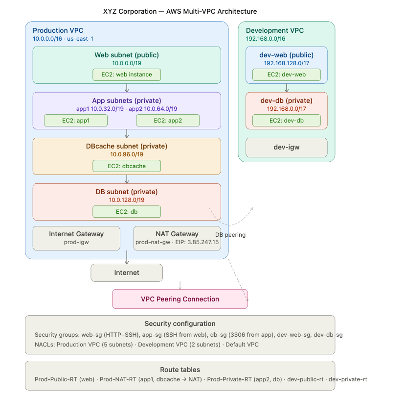

---

## 🔧 Infrastructure Details

### Production VPC — 10.0.0.0/16

| Tier | Subnet | Type | CIDR | Instance | Internet Access |
|------|--------|------|------|----------|----------------|
| Web | web | Public | 10.0.0.0/19 | EC2: web | ✅ Via IGW |
| App | app1 | Private | 10.0.32.0/19 | EC2: app1 | ✅ Via NAT |
| App | app2 | Private | 10.0.64.0/19 | EC2: app2 | ❌ None |
| Cache | dbcache | Private | 10.0.96.0/19 | EC2: dbcache | ✅ Via NAT |
| DB | db | Private | 10.0.128.0/19 | EC2: db | ❌ None |

### Development VPC — 192.168.0.0/16

| Tier | Subnet | Type | CIDR | Instance | Internet Access |
|------|--------|------|------|----------|----------------|
| Web | dev-web | Public | 192.168.128.0/17 | EC2: dev-web | ✅ Via IGW |
| DB | dev-db | Private | 192.168.0.0/17 | EC2: dev-db | ❌ None |

---

## ⚙️ AWS Services Used


| Service | Purpose |
|---------|---------|
| Amazon VPC | Two isolated network environments |
| EC2 t3.micro | Compute instances across all tiers |
| Internet Gateway | Public subnet internet access |
| NAT Gateway | Outbound internet for private subnets |
| Elastic IP | Static IP address for NAT Gateway |
| Security Groups | Instance-level inbound/outbound control |
| Network ACLs | Subnet-level traffic filtering |
| VPC Peering | Private connectivity between VPCs |
| Route Tables | Subnet-level traffic routing |

---

## 🔒 Security Architecture

### Security Groups — Instance-Level

| Security Group | Inbound Rules | Purpose |
|---------------|---------------|---------|
| web-sg | HTTP 80 + SSH 22 from 0.0.0.0/0 | Public web access |
| app-sg | SSH 22 from web subnet only | Locked to web tier |
| db-sg | MySQL 3306 from app subnet only | DB access restricted |
| dev-web-sg | HTTP 80 + SSH 22 from 0.0.0.0/0 | Dev web access |
| dev-db-sg | SSH 22 from dev-web only | Dev DB restricted |

### Network ACLs — Subnet Level

| NACL | Subnets | Key Rules |
|------|---------|-----------|
| Production NACL | All 5 prod subnets | Allow all + MySQL 3306 restriction |
| Development NACL | Both dev subnets | Allow all + outbound restricted |

---

## 🌍 Connectivity Design

```
Internet
    |
    v
Internet Gateway (prod-igw)
    |
    v
Web Subnet (public) --> EC2: web
    |
    v
App Subnets (private)
    |-- app1 --> EC2: app1 (NAT access)
    └-- app2 --> EC2: app2 (no internet)
    |
    v
DBCache Subnet --> EC2: dbcache (NAT access)
    |
    v
DB Subnet --> EC2: db (fully isolated)

VPC Peering: Production <-> Development
DB Subnets connected for cross-environment database access
```
---

## 📋 Route Tables

| Route Table | Associated Subnet | Routes |
|-------------|------------------|--------|
| Prod-Public-RT | web | 0.0.0.0/0 → prod-igw |
| Prod-NAT-RT | app1, dbcache | 0.0.0.0/0 → prod-nat-gw |
| Prod-Private-RT | app2, db | Local only |
| dev-public-rt | dev-web | 0.0.0.0/0 → dev-igw |
| dev-private-rt | dev-db | Local only |

---

## 📸 Screenshots

### 01 — Both VPCs Created
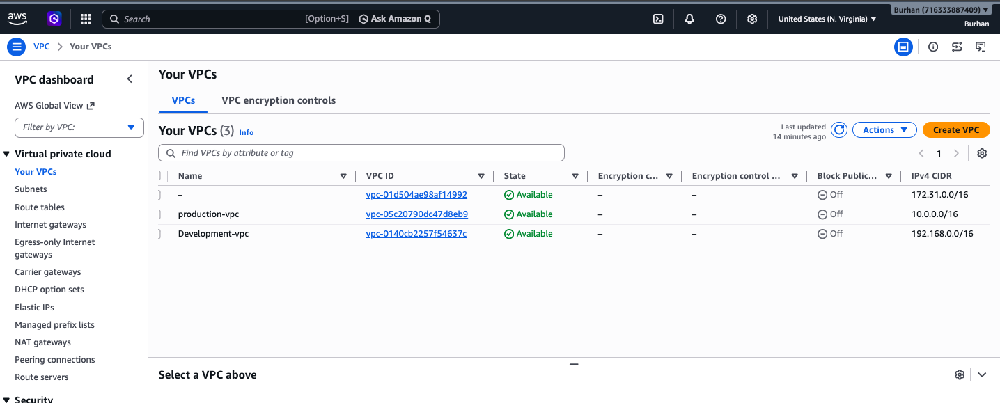

### 02 — Production Subnets (All 5)
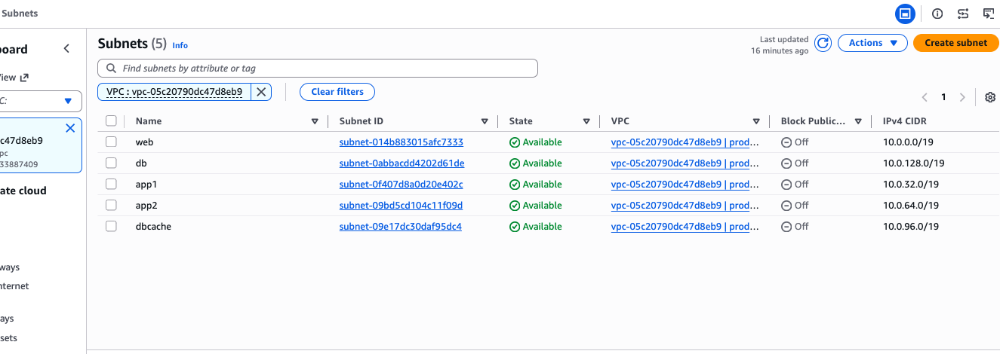

### 03 — Route Tables Configuration
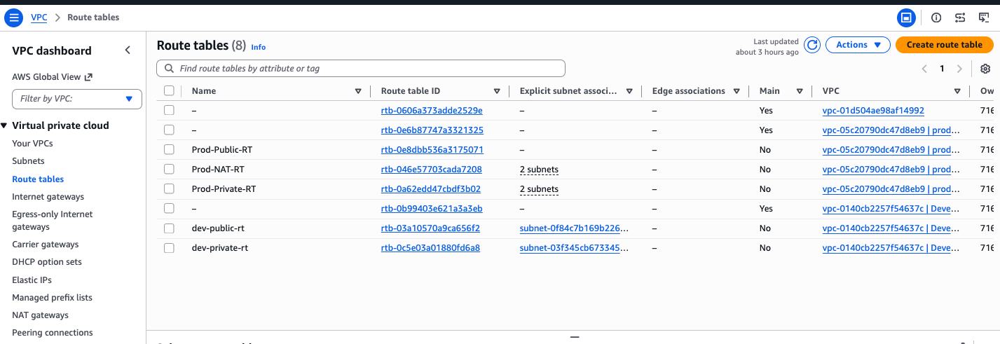

### 04 — All EC2 Instances Running
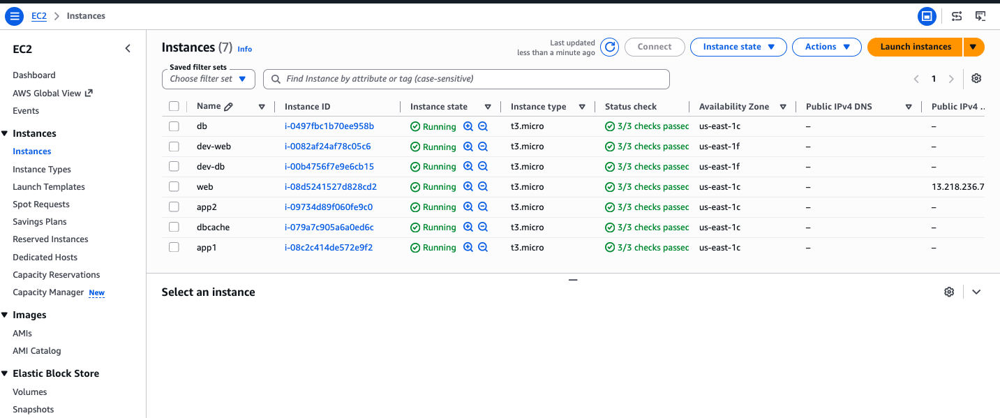

### 05 — Security Groups
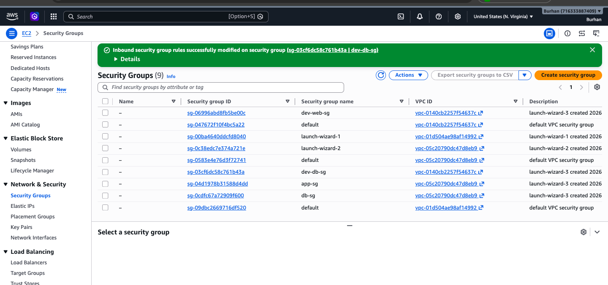

### 06 — NAT Gateway Details
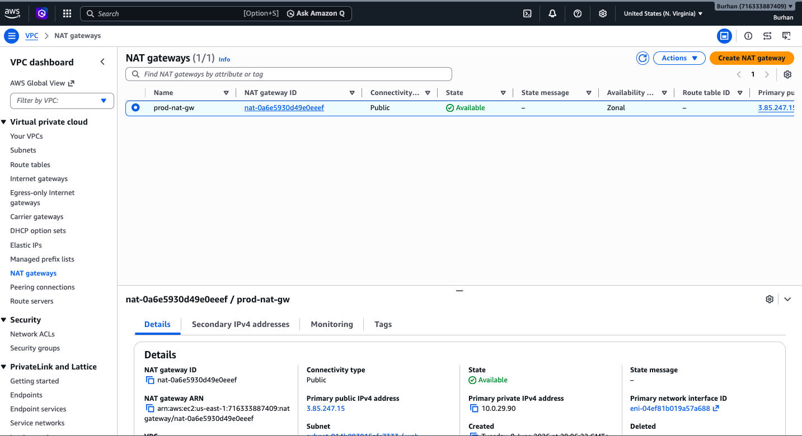

### 07 — Network ACLs
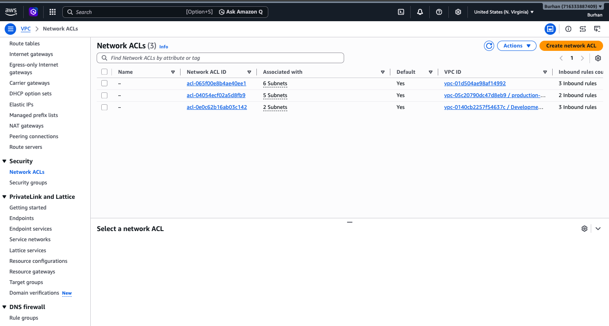

### 08 — NACL Inbound Rules (Port 3306 Restriction)
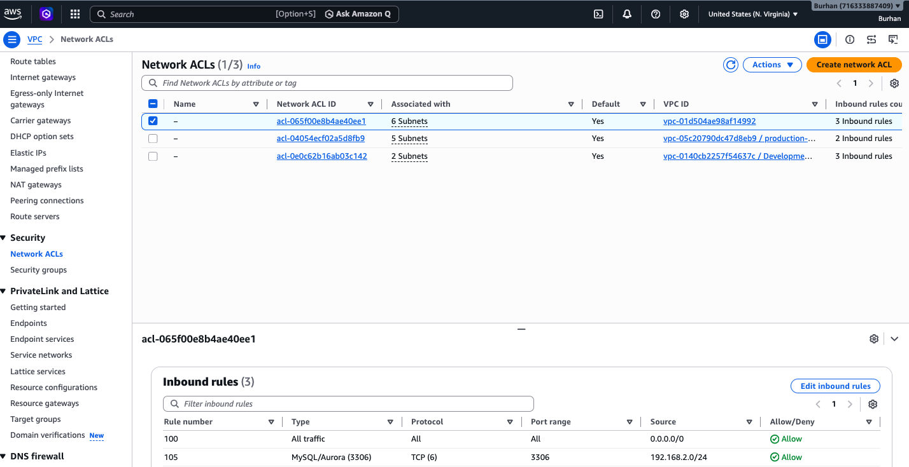

### 09 — All Subnets Overview
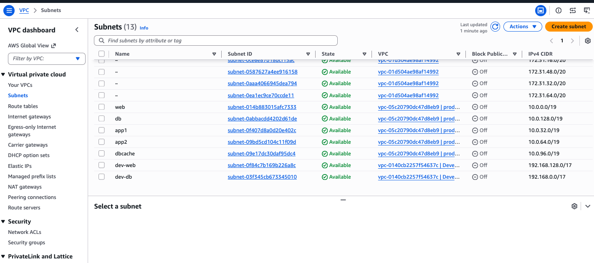

### 10 — Internet Gateways (Both Attached)
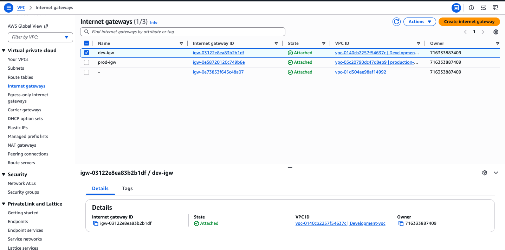

### 11 — Elastic IP for NAT Gateway
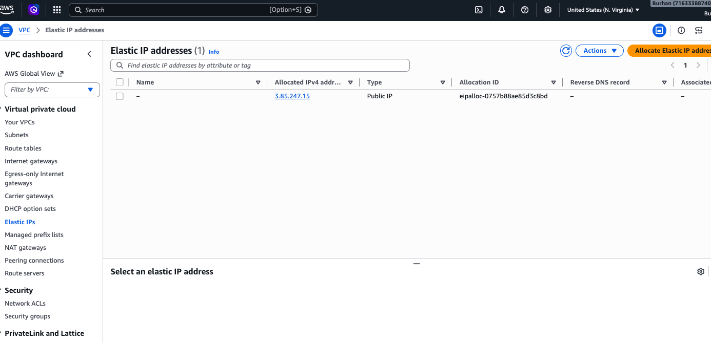

### 12 — VPC Peering Connection (Prod-to-Dev)
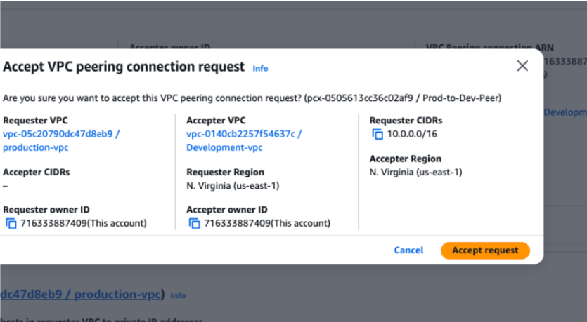

### 13 — Development Subnet Associations
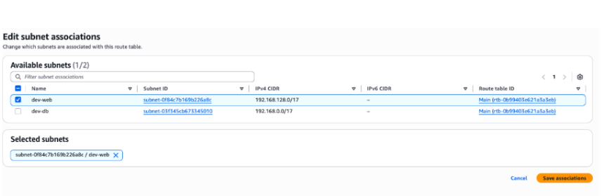

---

## 📚 Key Technical Learnings

- Designing multi-tier VPC with strict network isolation per layer
- Implementing NAT Gateway for selective private subnet internet access
- Defense-in-depth security using both Security Groups and NACLs
- VPC Peering for private cross-environment connectivity
- Route table management for precise traffic control
- Understanding stateful vs stateless security — SGs vs NACLs

---

## 💡 Real World Application

This architecture pattern is used by enterprises running:
- E-commerce platforms — web tier public, payment processing private
- Healthcare systems — patient data fully isolated
- Banking applications — multi-tier security compliance
- SaaS products — separate prod and dev environments

---

## 💰 Cost Awareness

| Resource | Cost |
|----------|------|
| EC2 t3.micro x7 | Free tier eligible |
| NAT Gateway | ~$0.045/hour |
| Elastic IP | Free when attached |
| VPC Peering | Free within same region |

> All resources terminated after project completion.
> Estimated total project cost: under $1.

---

## 🧹 Cleanup Performed

- All 7 EC2 instances terminated
- NAT Gateway deleted
- Elastic IP released
- VPC Peering connection deleted
- Both custom VPCs deleted
- All subnets, route tables, and security groups removed

---

## 🔗 Connect With Me

[](https://linkedin.com/in/burhan-bashir-hakim-48a8a3225)
[](mailto:burhanbash8@gmail.com)
[](https://github.com/Burhan-Hakim)

---
